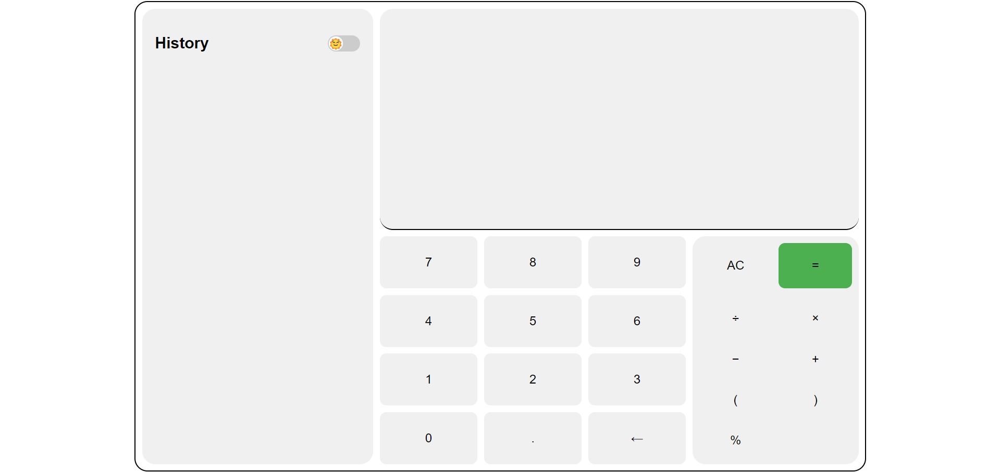
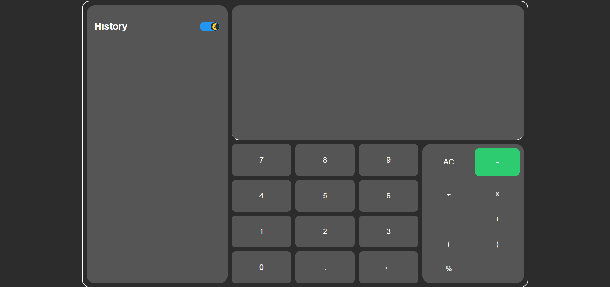

# Calculator

This project implements a simple calculator with basic arithmetic operations using HTML, CSS, and JavaScript. It features a history display and a toggle for light and dark modes.

## Features

- **Calculator Operations**: Addition, subtraction, multiplication, division, percentage calculations.
- **History Display**: Shows previous calculations.
- **Light/Dark Mode**: Toggle between light and dark themes.

## Technologies Used

- **HTML**: Structure of the calculator.
- **CSS**: Styling for the calculator and theme toggle.
- **JavaScript**: Logic for calculator operations and theme toggling.

## Preview

### Light Mode


### Dark Mode



## Access the Calculator

To access the calculator webapp, [click here](https://miralhsn.github.io/LGMVIP-Web-Task-3/).


## Usage

1. **Clone the Repository**:
    ```sh
    git clone https://github.com/miralhsn/LGMVIP-Web-Task-3.git
    ```
2. **Open the Project**:
    Open `index.html` in your web browser.

## Customization

- **Theme**: Modify the CSS variables in `style.css` to change colors for light and dark modes.
- **Functionality**: Edit `script.js` to add more operations or customize behavior.

## Contributing

Contributions are welcome! Fork the repository and submit a pull request.

## License

This project is licensed under the MIT License - see the [LICENSE](LICENSE) file for details.

## Contact

For any questions or suggestions, feel free to reach out to me at [miralqureshi@gmail.com](mailto:miralqureshi@gmail.com).
